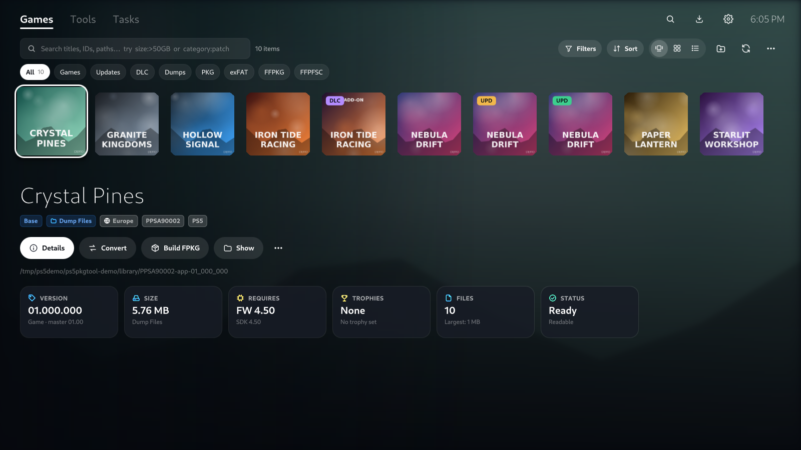
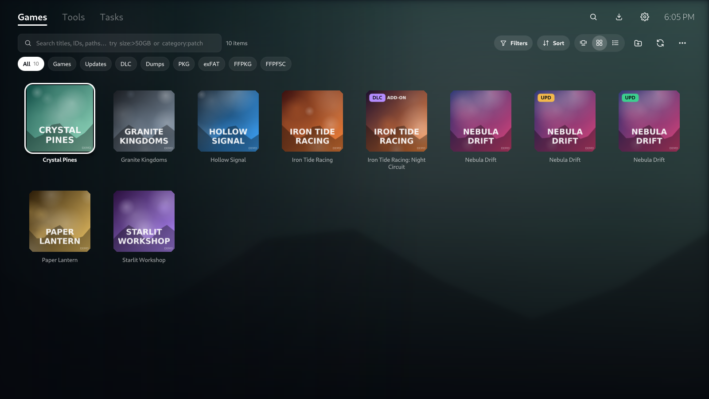
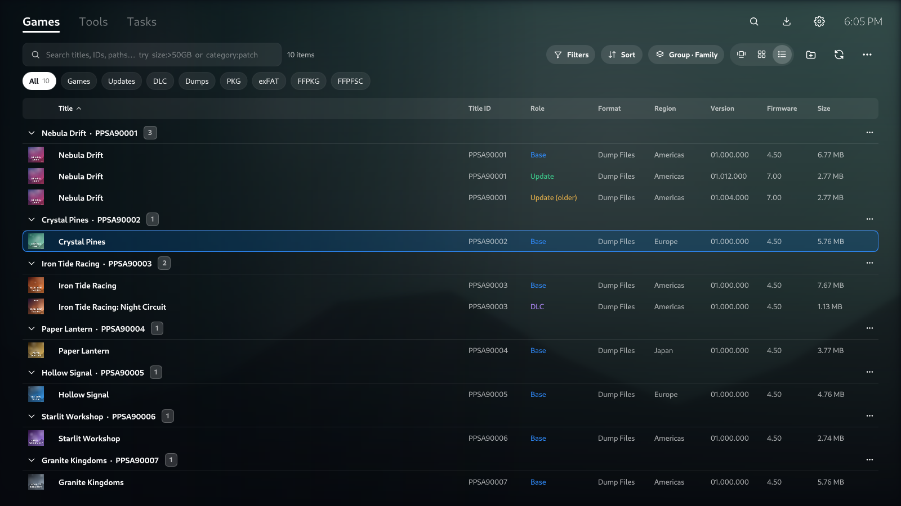
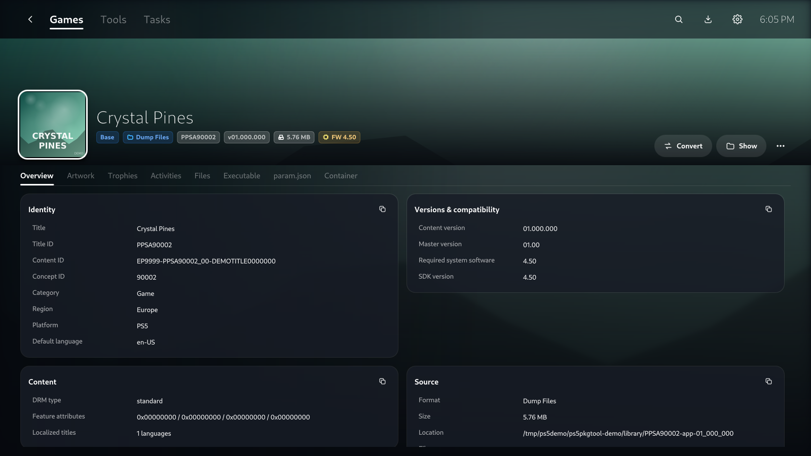
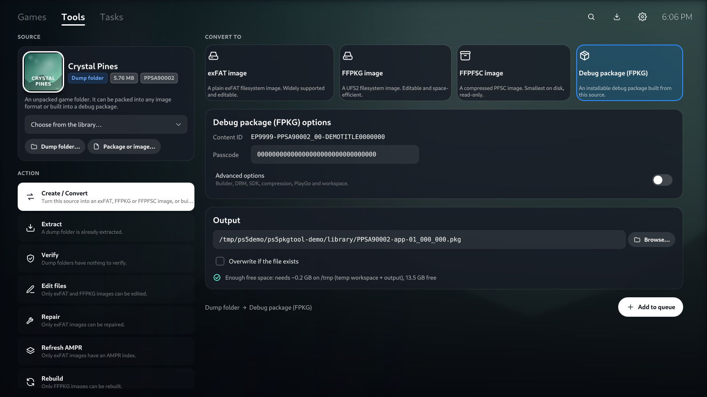
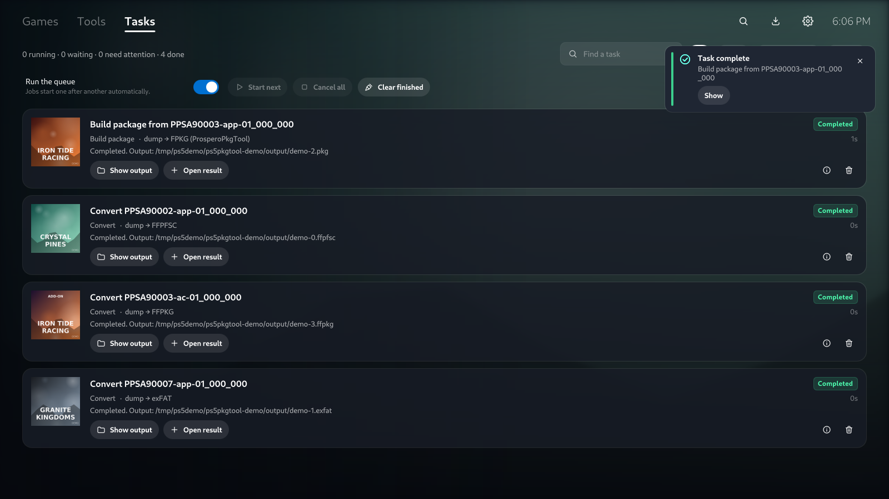
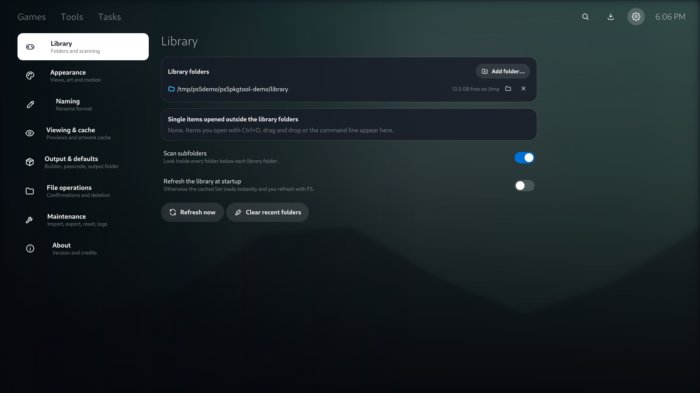

# PS5 PKG Tool



[](https://github.com/pearlxcore/PS5PKGTool/releases/latest)
[](LICENSE)
[](https://github.com/pearlxcore/PS5PkgTool)
[]()
[]()
[]()

Manage your PS5 dump and image collection, read PS5 packages, and build or convert images.

There are two editions, built on the same engine:

- **Linux edition**: a native Qt 6 app with a PS5-inspired interface. Its source is in
  [`PS5PKGTool.Qt`](PS5PKGTool.Qt) and [`PS5PKGTool.Bridge`](PS5PKGTool.Bridge).
- **Windows edition**: the original WinForms app. Its source is in [`PS5PKGTool`](PS5PKGTool), and it is
  described in [the Windows section](#windows-edition) below.

Suggestions are welcome. Report bugs [here](https://github.com/pearlxcore/PS5PkgTool/issues).

**This is not software for obtaining free PS5 games.**

> **Experimental:** Images and packages generated by PS5 PKG Tool have been validated and compared on PC, but they have not been tested on a jailbroken PS5. A successful build or validation does not guarantee that an image will mount, or that a package will install, launch, or play correctly on real hardware. Keep backups and use generated output at your own risk.

## Contents

- [Linux edition](#linux-edition)
  - [Screenshots](#screenshots)
  - [Features](#features)
  - [Install and build](#install-and-build) ([quick start](#quick-start-one-command))
  - [Using the app](#using-the-app)
  - [Search syntax](#search-syntax)
  - [Keyboard shortcuts](#keyboard-shortcuts)
  - [Where your data lives](#where-your-data-lives)
  - [Troubleshooting](#troubleshooting)
  - [How it is built](#how-it-is-built)
- [Windows edition](#windows-edition)
- [Support my work](#support-my-work)
- [License](#license)
- [Credit](#credit)

---

# Linux edition

The Linux edition takes the console's design language: deep navy surfaces, white type and
PlayStation blue accents. The selected title's key art fills the window behind the interface. A
row of game tiles sits on top, and the focused title gets a hero panel with the facts that matter
and the actions you can take. Everything the Windows edition can do is here, in a layout that
explains what each option means before you use it.

## Screenshots

> The screenshots use the built-in demo library (`--demo`): fictional titles with generated
> artwork. No real game data is shown.

| | |
|---|---|
|  |  |
| **Home**: the tile row, a hero panel and info cards | **Game library**: every item as a tile |
|  |  |
| **List**: sortable columns, family groups, multi-select | **Details**: overview, artwork, trophies, files and more |
|  |  |
| **Tools**: pick a source, an action and a target | **Tasks**: a download-style queue with progress |



## Features

**A console-style library**

- Three views:
  - **Home**: a tile row with a hero panel.
  - **Game library**: a grid of tiles.
  - **List**: a dense table for large collections.
- The selected title's key art (pic0 or pic1) is blurred behind the interface. You can set the blur
  and brightness, or turn it off.
- Every title shows its icon0 art. DDS artwork is decoded automatically, and art is cached for instant browsing.
- The hero panel shows:
  - Badges for role (Base, Update, older Update, DLC, App), format, region, title ID and platform.
  - **Info cards**: version, size on disk, required firmware and SDK, trophy counts by grade, file
    count and largest file, and a status line ("Older update", "No base game", "Source missing").
  - One-click **Details**, **Convert**, **Build FPKG**, **Extract** and **Show in file manager**.
- **Quick presets** filter the library: Games, Updates, DLC, Dumps, PKG, exFAT, FFPKG and FFPFSC.
  There are also multi-select category, region and format filters, a search bar with an
  autocomplete [grammar](#search-syntax), and **saved views**.
- The list view adds:
  - Sorting on several columns at once (Shift+click a header to add a column).
  - Grouping by **family** (base, updates and DLC together), title ID, category, region, format
    or firmware, with collapsible groups.
  - Ctrl/Shift multi-select.
- Scans dump folders (`sce_sys/param.json`), `.pkg` packages and `.exfat`, `.ffpkg` and `.ffpfsc`
  images. Loads instantly from a cache, and dump sizes are measured in the background.
- Drag and drop folders, packages or images onto the window. Opening a path while the app is
  already running hands it to that window.

**Library actions** (right-click a title or use ⋯)

- Copy the title, title ID, content ID, file name or path.
- **Rename** with 12 presets, your own format, or *by install order* for packages. Every rename is
  previewed first, and name clashes are numbered instead of overwritten.
- **Move** items into folders grouped by title, title ID, category, region or format. You see a
  preview first, and moves across drives copy, verify and only then remove the original.
- **Move to trash** (the freedesktop.org trash) or delete permanently. This only works for items
  inside your library folders, and never while a task is using them.
- Save artwork, export CSV, **find duplicates** (byte-identical or possible), and list
  **updates without a base game**.

**Details for every title**

- **Overview**: grouped cards for identity, versions and compatibility, content, source, package,
  and a "what could be read" health list. Click any value to copy it.
- **Artwork**: icon and key art with format and resolution, a full-screen viewer, and save.
- **Trophies**: cards with icons and grade colours, grade filters, hidden-trophy toggle, search,
  CSV export.
- **Activities**: UDS events with their properties, plus stats, enum groups and extraction rules.
- **Files**:
  - Browse folder by folder or search across every file, and see folder sizes.
  - Preview images (DDS decoded), text and JSON, a paged **hex view**, or **audio and video**
    with Qt Multimedia.
  - Extract single files, folders or everything.
- **Executable**: SELF/ELF header, modules, program headers, sections, SELF segments,
  `eboot.bin` SHA-256, and extraction of executables.
- **param.json**: formatted or original.
- **Container / Package**: header, segments, CNT entries, `param.sfo`, keystone and NP files,
  PlayGo chunks, scenarios and file map, and SI contents.

**Tools**

1. **Pick a source**: the selected title, any dump folder, or any package or image. The tool
   explains in plain words what it is and what can be done with it.
2. **Pick an action**:
   - Create / Convert.
   - Extract.
   - Verify.
   - Edit files (exFAT and FFPKG).
   - Repair (exFAT).
   - Refresh AMPR (exFAT).
   - Rebuild (FFPKG).

   Unavailable actions say why.
3. **Pick a target**: an exFAT, FFPKG or FFPFSC image, or a **debug package (FPKG)**.
4. **Options** start from safe defaults:
   - exFAT: cluster size and the AMPR index.
   - FFPKG: block and fragment size, inode density and reserved space.
   - FFPFSC: compression level and minimum gain.
   - FPKG: the content ID is read from the source, and you can set the passcode. **Advanced**
     shows the builder (LibProsperoPkg or ProsperoPkgTool, each remembering its own settings), DRM
     type, SDK version, compression, Kraken level and threads, PlayGo chunks, workspace,
     deterministic build, fake-signing and right.sprx.
5. **Summary**: the output path, the overwrite option and a **live free-space check** on the
   actual mount points. Then **Add to queue**.

- The **image editor** browses an exFAT or FFPKG image and queues replace, add file, add folder,
  new folder and delete. All changes are applied in one pass and verified before they replace the
  image.

**Tasks**

- One job runs at a time, in a persistent queue that is restored after a restart. A job that was
  running when the app closed comes back as *interrupted* and can be retried with the same options.
- Each job shows its art, route (for example *dump → FPKG (LibProsperoPkg 1.2.0)*), a step
  progress bar and an overall bar, elapsed time, an ETA and a plain result.
- Cancel, retry, remove, show output, open the result in the library, and a diagnostic report
  with secrets masked.
- "Run the queue" can be turned off to hold jobs. Toast notifications appear when a job finishes,
  and a progress ring in the top bar shows the running job.

**Settings**

- **Library**: folders (with free space), opened items, scan subfolders, refresh at startup.
- **Appearance**: view, background art with blur and brightness, reduce motion, list density and
  thumbnails, default grouping, notifications.
- **Naming**: the rename format with a live example from your selected title, a token picker and
  presets.
- **Viewing & cache**: preview limits, hex page size, cache size and clearing.
- **Output & defaults**: default output folder, default builder (with availability), default
  debug passcode, and showing the output when a job succeeds.
- **File operations**: move previews, trash confirmation, permanent delete.
- **Maintenance**: export and import preferences (an import shows a diff first and accepts files
  from the Windows edition), reset, cache, logs and data folder.
- **About**: versions, builder status, links and credits.

## Install and build

### Quick start (one command)

```sh
git clone -b linux-qt https://github.com/minusxne/PS5PKGTool.git
cd PS5PKGTool
./setup-linux.sh
```

`setup-linux.sh` does everything, asking before each step:

1. Installs the build dependencies with your package manager (apt, dnf, pacman or zypper; needs
   sudo).
2. Installs the .NET 10 SDK for your user in `~/.dotnet` if it is missing (no sudo).
3. Builds the app.
4. Installs it to `~/.local`, so **PS5 PKG Tool** appears in your application menu.

| Command | What it does |
|---|---|
| `./setup-linux.sh --yes` | Same, without questions (sudo still asks for your password). |
| `./setup-linux.sh --no-deps` | Skips the package step, if you installed the dependencies yourself. |
| `./setup-linux.sh --no-install` | Builds only. Run `./dist/bin/ps5pkgtool`. |
| `./setup-linux.sh --prefix /usr/local` | Installs elsewhere (asks for sudo when needed). |
| `./setup-linux.sh --appimage` | Also builds `PS5_PKG_Tool-x86_64.AppImage`. |
| `./setup-linux.sh --uninstall` | Removes the installation. Your settings and library cache are kept. |

There are also `make` shortcuts: `make setup`, `make build`, `make run`, `make demo`, `make test`,
`make install`, `make uninstall`, `make appimage` and `make clean`.

To update later, run `git pull`, then `./setup-linux.sh --no-deps`.

The sections below explain the manual route.

### Requirements

- Linux on x86-64, X11 or Wayland.
- **Qt 6.5 or newer**: Base, Declarative (Quick and Controls), SVG and D-Bus. Qt Multimedia is
  optional and enables audio and video previews.
- **.NET 10 SDK**, only to build. The engine is published self-contained, so running the app needs
  no .NET.
- **CMake 3.21+** and a C++17 compiler. Ninja is recommended.

### 1. Install the dependencies

**Debian 13 / Ubuntu 24.10 and newer**

```sh
sudo apt install build-essential cmake ninja-build \
  qt6-base-dev qt6-declarative-dev qt6-svg-dev qt6-multimedia-dev \
  qml6-module-qtquick qml6-module-qtquick-controls qml6-module-qtquick-layouts \
  qml6-module-qtquick-window qml6-module-qtquick-dialogs qml6-module-qtquick-effects \
  qml6-module-qtquick-shapes qml6-module-qtquick-templates qml6-module-qtqml-workerscript \
  qml6-module-qtmultimedia qml6-module-qtcore
```

**Fedora**

```sh
sudo dnf install gcc-c++ cmake ninja-build qt6-qtbase-devel qt6-qtdeclarative-devel \
  qt6-qtsvg-devel qt6-qtmultimedia-devel
```

**Arch Linux**

```sh
sudo pacman -S base-devel cmake ninja qt6-base qt6-declarative qt6-svg qt6-multimedia
```

**.NET 10 SDK**: use your distribution's package if it has one (`dotnet-sdk-10.0`). Otherwise
install it for your user only:

```sh
curl -sSL https://dot.net/v1/dotnet-install.sh | bash -s -- --channel 10.0
```

The build script finds `~/.dotnet` by itself.

### 2. Build

```sh
./build-linux.sh
./dist/bin/ps5pkgtool
```

`build-linux.sh` publishes the engine to `dist/lib/ps5pkgtool/bridge`, builds the Qt app and
stages everything under `dist/`, ready to run from that folder.

| Option | What it does |
|---|---|
| `--install ~/.local` | Also installs the app, desktop entry, icons and AppStream metadata under a prefix. Use `sudo` for `/usr/local`. |
| `--appimage` | Packages `dist/` as `PS5_PKG_Tool-x86_64.AppImage` with linuxdeploy, which it downloads if needed. |
| `--qt ~/Qt/6.8.2/gcc_64` | Uses a Qt from the online installer instead of the system one. |
| `--debug`, `--jobs N`, `--clean` | Debug build, parallel jobs, start from scratch. |

### Try it without real games

```sh
./dist/bin/ps5pkgtool --demo
```

This starts with a **separate profile** (your real library and settings are not touched) and a
generated library of fictional titles with procedurally drawn art. It is useful to explore the
interface or to try conversions and package builds on harmless data.

### Command line

```
ps5pkgtool [paths...]          open dump folders, packages or images (added as single items)
ps5pkgtool --demo              demo profile and library
ps5pkgtool --screenshot FILE --page games|grid|list|details|details:<tab>|tools|tasks|settings [--size WxH]
```

### Run the tests

```sh
dotnet test PS5PKGTool.Linux.slnx
```

The tests cover:

- The search grammar, classification, grouping and sorting.
- Rename planning and the RPC server.
- End-to-end round trips of a synthetic dump through exFAT, FFPKG and FFPFSC (convert, verify,
  extract, then compare every byte).
- Debug-package builds with **both** builders, read back with the canonical reader.

## Using the app

1. **Add a library folder.** On first launch, choose **Add library folder** and pick the folder
   that holds your dumps, packages and images (subfolders are scanned). Add as many as you like
   in *Settings › Library*. **F5** rescans.
2. **Browse.** Use the arrow keys or the mouse in the tile row. The hero panel updates as you go;
   trophy and file facts appear a moment later. Switch views with the three buttons beside *Sort*.
3. **Open the details** with **Enter**, a double-click or **Details**. **←/→** switch tabs and
   **Esc** goes back.
4. **Convert or build.**
   - **Convert** opens Tools with the item selected.
   - **Build FPKG** goes straight to the debug-package target.
   - Check the summary and choose **Add to queue**.
5. **Follow the job** on the **Tasks** tab, or keep working: a toast tells you when it is done,
   and **Show** opens the result in your file manager.

Tips:

- Right-click any title (or press the Menu key) for every action: copy, rename, move, artwork,
  CSV, trash.
- In the list view, *Group › Family* shows each game with its updates and DLC, and older updates
  are marked.
- Drag a folder full of games onto the window to add it as a library folder. Drag a single dump,
  package or image to open just that item.

## Search syntax

Words must all match. Use quotes for phrases, `-` to exclude, `|` for "either", and `=` for an
exact value. Field searches:

| Field | Example | Matches |
|---|---|---|
| `title:` | `title:"gran turismo"` | title, including localized titles |
| `id:` | `id:=PPSA01234` | title ID (`=` for exact) |
| `content:` | `content:UP9000` | content ID |
| `category:` | `category:patch\|dlc` | Game, Patch, DLC, App |
| `role:` | `role:older` | Base, Update, Update (older), DLC, App |
| `region:` | `region:europe` | Americas, Europe, Japan, Korea, Asia, Hong Kong |
| `source:` / `format:` | `source:exfat` | Dump Files, PKG, FFPFSC, exFAT, FFPKG |
| `size:` | `size:>50GB` | `>`, `>=`, `<`, `<=`, `=` with B/KB/MB/GB/TB |
| `version:` | `version:>=1.10` | content version, compared numerically |
| `fw:` / `firmware:` | `fw:<=7.00` | required system software |
| `feature:` | `feature:vr` | declared features |
| `drm:` | `drm:free` | DRM type |
| `path:` | `path:/mnt/games` | location |

A **Check query** badge appears when part of a query cannot be understood. The query still runs.

## Keyboard shortcuts

| Keys | Action |
|---|---|
| ← → ↑ ↓ | Move between titles, tabs and buttons |
| Enter | Open details |
| Esc | Back, or clear the search |
| Menu / right-click | Actions for the selection |
| Ctrl+F | Search the library |
| F5 / Ctrl+R | Refresh the library |
| Ctrl+O / Ctrl+Shift+O | Open a dump folder / a package or image |
| Ctrl+1 … Ctrl+4 | Games, Tools, Tasks, Settings (Ctrl+, also opens Settings) |
| Ctrl+L | Activity log |
| Ctrl+A (list view) | Select all visible items |
| Ctrl+Q | Quit |

## Where your data lives

| What | Where |
|---|---|
| Settings, library cache, task queue | `~/.local/share/PS5PKGTool/` (`$XDG_DATA_HOME`). The folder is private to your user. |
| Log | `~/.local/share/PS5PKGTool/logs/PS5PKGTool.log`, also shown live with **Ctrl+L** |
| Decoded artwork and previews | `~/.cache/PS5PKGTool/` (`$XDG_CACHE_HOME`); safe to delete, see *Settings › Maintenance* |
| Demo profile | `~/.cache/ps5pkgtool-demo/` |

`settings.json` uses the same format as the Windows edition, so preferences can be exported on
one system and imported on the other.

## Troubleshooting

- **The window opens but stays on "Starting the engine…"**: the app can't find or start
  `ps5pkgtool-bridge`. Run from `dist/bin` (or the install prefix) so it finds
  `../lib/ps5pkgtool/bridge`, or set `PS5PKGTOOL_BRIDGE=/path/to/ps5pkgtool-bridge`. The engine's
  own messages appear in the activity log (**Ctrl+L**).
- **"module QtQuick.Effects is not installed"** (or Dialogs, Shapes and so on): install the
  matching `qml6-module-*` package from the list above.
- **Audio and video don't play in the preview**: install Qt Multimedia
  (`qml6-module-qtmultimedia`). You can always use *Open with the default app* instead.
- **No art or blur, everything looks flat**: you are on the software renderer (no GPU
  acceleration, common in VMs and remote sessions). The app detects this and turns effects off.
  Everything still works.
- **LibProsperoPkg is unavailable**: *Settings › About* shows why. Builds fall back to
  ProsperoPkgTool automatically. The Linux build needs the Magick.NET native library that
  `build-linux.sh` downloads from NuGet.
- **"Not enough free disk space"**: package builds need roughly twice the source size across the
  output and workspace volumes. The check measures the real mount points, so choose a workspace or
  output on a bigger drive in the advanced options.
- **Retail packages can't be opened**: only debug (FPKG) packages built with a known passcode
  can be decoded. That is by design.
- **Case-sensitive filesystems**: lookups inside images are case-insensitive. Loose dumps are
  expected to use the standard lowercase `sce_sys` names.

## How it is built

```
┌────────────────────────────┐   JSON lines (stdin/stdout)   ┌───────────────────────────────┐
│ ps5pkgtool (C++ / Qt 6 QML) │ ───────────────────────────▶ │ ps5pkgtool-bridge (.NET 10)   │
│  • QML interface            │ ◀─────────────────────────── │  • library, details, tools,   │
│  • models, desktop helpers  │   results + live events       │    tasks services             │
└────────────────────────────┘                               │  • PS5PKGTool.Core / Ffpfsc / │
                                                             │    Ufs2 (shared with Windows) │
                                                             └───────────────────────────────┘
```

- **`PS5PKGTool.Bridge`** is a headless .NET process that runs the same Core, Ffpfsc and Ufs2
  libraries as the Windows edition.
  - It holds the library, settings, artwork cache and task queue.
  - It speaks a small JSON-lines protocol, documented in
    [`PS5PKGTool.Bridge/PROTOCOL.md`](PS5PKGTool.Bridge/PROTOCOL.md), so you can also script it.
- **`PS5PKGTool.Qt`** is the native frontend:
  - `BridgeClient` starts the engine, matches replies to requests and restarts it if it crashes.
  - `LibraryStore`, `TableModel` and `FileBrowserModel` feed the views.
  - `Desktop` covers trash, reveal over D-Bus, the clipboard and screenshots.
  - The interface is QML with a small design system (`Theme.qml`, pill buttons, chips, cards,
    tiles, toasts).
- **`PS5PKGTool.Bridge.Tests`** exercises the engine end to end.
- Linux-specific fixes in the shared libraries:
  - Mount-aware volume detection for moves and free-space checks.
  - libc hard links for the LibProsperoPkg DRM overlay.
  - Ordinal path checks on case-sensitive filesystems.
  - Rename sanitising that stays valid for exFAT and NTFS drives.
  - linux-x64 native library probing for LibProsperoPkg.

Build the engine alone with `dotnet build PS5PKGTool.Linux.slnx`. Build the Qt app alone with
`cmake -S PS5PKGTool.Qt -B build/qt && cmake --build build/qt`; the build-tree binary runs the
engine from `PS5PKGTool.Bridge/bin/Debug/net10.0`.

---

# Windows edition


A Windows app for managing your PS5 dump and image collection, reading PS5 packages, and building or converting images.

## Requirement

- Windows 10 or 11 (64-bit).

The release build is self-contained and includes the .NET runtime, so nothing else needs to be installed.

## Features

**Library Management**

- Scan folders for unpacked dumps, Sony `.pkg` files, `.ffpfsc`, `.ffpkg`, and `.exfat` images.
- Manifest cache, so the library loads instantly after the first scan.
- Group the list by Title ID, **Family** (base game, updates and DLC together), Category, Region, Source format, or Firmware.
- Sort by one column, or **Shift+click** further column headers for a multi-column sort.
- **Saved views** remember a query, filters, grouping, sort and column layout under a name.
- A **Role** column labels each item Base, Update, DLC or App and marks updates that a newer patch supersedes.
- Filter by Category, Region, and Format, use the presets for common cases, or type in the search box with a small query grammar (`title:`, `id:`, `content:`, `category:`, `role:`, `region:`, `size:>50GB`, `version:`, `fw:`, `feature:`, `path:`, `-exclude`, quoted phrases, and `|` for OR). Add `=` for an exact value (`id:=PPSA12345`); a "Check query" hint appears when a token cannot be understood.
- Right click actions: copy Title, Title ID, Content ID, file name or path, rename (with a preview of every new name), move into folders (with a preview of every destination), delete to the Recycle Bin, save artwork, extract a package, and convert the selected image. Export the selected rows, the visible rows, or the whole library; **Find Duplicates** hashes `param.json` to separate byte-identical copies from possible ones.
- Appearance settings include a Compact / Normal / Comfortable density preset for the list.

**Game Details and Files**

- Detail tabs for Overview, Artwork, Trophies, Activities, Files, Executable, Raw param.json, and Container.
- Browse the files inside a dump, image, or package and extract individual files or whole folders.
- File viewer with image, text, hex, and media previews.
- Trophy list with grades and icon export, activity and UDS tables, module and SELF info, and PlayGo chunk data for packages.

**Image Tools**

The Tools workspace has one unified form. Pick a source (the selected library item or a file), then pick an action.

- **Create / Convert** between dump folders and exFAT, FFPKG, and FFPFSC images, or build a debug package (FPKG) from a dump or image.
- **Extract** a dump tree out of an image, or extract package contents.
- **Verify** an image or a package.
- **Edit Files** for exFAT and FFPKG images (replace, add, import a folder, create directories, delete).
- **Repair** a damaged exFAT image from its valid boot region.
- **Refresh AMPR** index for exFAT images.
- **Rebuild** FFPKG metadata from readable files.

Every long action runs on the Tasks tab; the form only queues work and reports progress there.

**Package (FPKG) Support**

- Read, verify, and extract debug PS5 packages (FPKG), including inner PFS browsing, trophies, activities, and PlayGo data.
- Build a debug package from an unpacked dump or directly from an image. The Content ID is read from the source automatically and the passcode is configurable; an optional seed gives byte reproducible output.
- Choose the builder: `LibProsperoPkg` (the default) or `ProsperoPkgTool`, the app's own internal FPKG builder, which is an alternative to LibProsperoPkg and is still experimental.
- Build settings include inner compression (Auto - Kraken where it helps, Kraken forced, or Uncompressed), Kraken level and thread count, PlayGo chunk count (default 1), an SDK version override, and an optional workspace folder. Package type is APP; AC (additional content) is not supported yet.
- Convert a debug package to exFAT, FFPKG, or FFPFSC.
- Retail packages are recognized but cannot be decoded without matching image key material. Only debug packages built with the default or a known passcode are fully readable.

**Task Queue**

- Sequential queue for every long operation: convert, extract, build, verify, repair, rebuild, and package work.
- Auto start or manual start, cancel, retry, remove, and clear completed.
- Tasks are saved and restored between launches. A task that was running when the app closed comes back as interrupted and can be retried.
- Each task shows a current step bar and an overall task step bar, for example Extract, Build, Verify.

**Native Frameworks**

- exFAT, UFS2/FFPKG, PFSC, and PFS are implemented in managed C#.
- PS5 package reading, verification, extraction, and debug package creation use the clean room MIT engine ProsperoPkgTool as a managed library.
- Kraken is encoded and decoded by the managed engines. See `THIRD_PARTY_NOTICES.md` for third-party components.

## Settings

Every preference lives in File > Settings, split across Library, Appearance, Naming, Viewing & Cache,
Output & Defaults, File Operations, and Maintenance. Visual preferences apply when you save; changing
library folders or Scan subfolders rescans when you save. Settings are saved before the dialog closes, so
a save failure keeps your edits and offers Retry. Import validates the file and shows what will change;
export leaves the debug passcode out unless you ask for it; Reset restores preference defaults but keeps
your folders, sources, recent folders and saved views.

## How To Build A Debug Package

1. Select an unpacked dump (or an image of one) in Image Tools.
2. Choose the `Debug Package (FPKG)` target.
3. Optionally set the passcode (blank uses the default all-zero passcode). The Content ID is read from the source's `param.json` automatically, so there is no field to fill in.
4. Pick a **builder**:
   - `LibProsperoPkg` - the default third-party builder.
   - `ProsperoPkgTool` - the app's own internal FPKG builder, offered as an alternative to LibProsperoPkg. It is **still experimental**; see the note below.
5. Optionally tick **Advanced options** to set compression (Auto / Kraken / Uncompressed), Kraken level and thread count, PlayGo chunks, package type, an SDK version override, a workspace folder, DRM handling, and fake-sign / right.sprx injection.
6. Run. Free disk space is checked before the build starts, the package is written to the output path, and progress is shown stage by stage on the Tasks tab.

> **Note:** ProsperoPkgTool is the app's own internal package builder, provided alongside LibProsperoPkg. It is still experimental - output has been validated on PC but not on jailbroken PS5 hardware. Keep originals and verify any produced package before relying on it.

## Build

```
dotnet build .\PS5PKGTool.slnx -c Release
```

The app is written to `PS5PKGTool\bin\Release\net10.0-windows\PS5 PKG Tool.exe`. The WinForms
project references DarkUI from a sibling checkout (`..\DarkUI`).

## Screenshot


## Download

[**Download Latest Release**](https://github.com/pearlxcore/PS5PkgTool/releases/latest) (Windows).

---

# Support my work

[](https://ko-fi.com/R6R524N7X)

[](https://www.paypal.com/paypalme/pearlxcoree)

# License

[GPL-3.0](LICENSE). See [`THIRD_PARTY_NOTICES.md`](THIRD_PARTY_NOTICES.md) for third party components,
including Qt (LGPL-3.0) for the Linux edition.

# Credit

- [Robin Perris](https://github.com/RobinPerris/DarkUI)
- [SvenGDK](https://github.com/SvenGDK/LibProsperoPKG)
- [PSBrew / Renan Barreto](https://github.com/PSBrew/MkPFS)
- [kerrdec97](https://github.com/kerrdec97/ps5-exfat-builder)
- [strongt1me](https://github.com/strongt1me/PS5-Dump-Image-Converter)
- Sony <3
